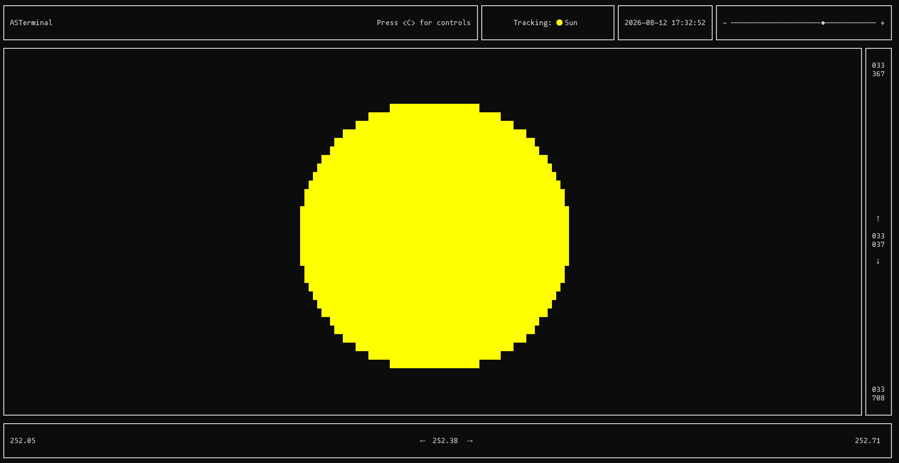
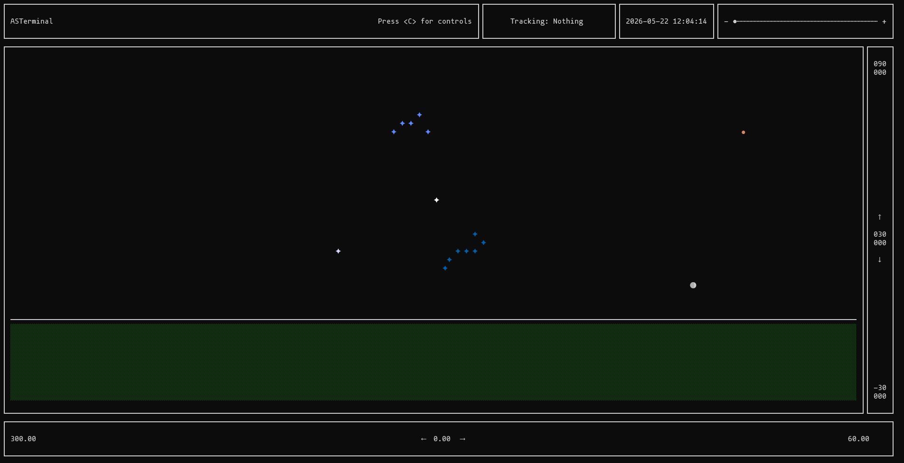

# ASTerminal

A terminal-based sky viewer, observe planets, the Moon, the Sun and major stars from any location on Earth, at any date.




---

## Features

- Real-time positions of the Sun, Moon and all planets (Mercury -> Pluto)
- Major star constellations (Ursa Major, Orion, Cassiopeia...)
- Zoom from a 120° wide-angle view down to 0.04° for planetary discs
- Time travel: step forward or backward in time to observe eclipses and transits
- Object tracking: lock the camera on any solar system body
- Correct topocentric parallax (the Moon's position depends on where you are)

---

## Installation

```bash
git clone https://github.com/mickaelblondeau/asterminal
cd asterminal
go build -o asterminal ./cmd/main.go
```

---

## Usage

```bash
./asterminal [options]
```

### Options

| Option | Description | Example |
|--------|-------------|---------|
| `--lat=<deg>` | Observer latitude (−90 to 90) | `--lat=50.63` |
| `--lon=<deg>` | Observer longitude (−180 to 180) | `--lon=3.06` |
| `--zoom=<0-100>` | Initial zoom level | `--zoom=50` |
| `--track=<name>` | Start tracking an object | `--track=moon` |
| `--date=<date>` | Simulate a specific date | `--date=2026-08-12` or `--date=2026-08-12T19:30:00` |

### Examples

```bash
# Just looking at the sky
./asterminal --lat=50.34809655855528 --lon=3.466621192456120

# Tracking the Moon
./asterminal --lat=50.34809655855528 --lon=3.466621192456120 --track=moon

# Solar eclipse of August 12, 2026
./asterminal --lat=50.34809655855528 --lon=3.466621192456120 --date=2026-08-12T16:37:00 --track=sun --zoom=65

# Mercure transit of November 11, 2019
./asterminal --lat=50.34809655855528 --lon=3.4666211924561203 --date=2019-11-11T12:00:00 --track=sun --zoom=65
```

### Trackable objects

`mercury` `venus` `mars` `jupiter` `saturn` `uranus` `neptune` `pluto` `sun` `moon`

---

## Controls

| Key | Action |
|-----|--------|
| `← → ↑ ↓` | Rotate camera |
| `+` / `-` | Zoom in / out |
| `p` / `o` | Track next / previous object |
| `PgUp` / `PgDn` | Time +1s / −1s |
| `Ctrl+PgUp` / `Ctrl+PgDn` | Time +1min / −1min |
| `C` | Show controls |
| `Esc` | Cancel tracking |
| `Ctrl+C` | Quit |

---

## Accuracy

Planetary positions use the simplified VSOP87 orbital elements from the JPL.
The Moon uses an ELP-style series with 59 longitude and 30 latitude terms, giving positional accuracy of ~0.3°, sufficient for naked-eye observation and eclipse detection, but not for sub-minute contact timing.
